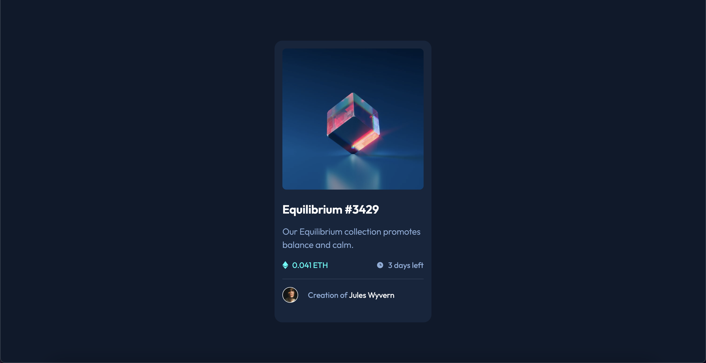

# Frontend Mentor - NFT preview card component solution

This is a solution to the [NFT preview card component challenge on Frontend Mentor](https://www.frontendmentor.io/challenges/nft-preview-card-component-SbdUL_w0U). Frontend Mentor challenges help you improve your coding skills by building realistic projects. 

## Table of contents

- [Overview](#overview)
  - [Screenshot](#screenshot)
  - [Links](#links)
- [My process](#my-process)
  - [Built with](#built-with)
  - [Useful resources](#useful-resources)
- [Author](#author)

## Overview

### Screenshot

### Links

- Solution URL: [GitHub Repository](https://github.com/kwadwoasante/fem-nft)
- Live Site URL: [Netlify Link](https://nft-fem.netlify.app/)

## My process

### Built with

- Semantic HTML5 markup
- TailwindCSS properties
- Mobile-first workflow

### Useful resources

- [TailwindCSS](https://tailwindcss.com/) - This helped me in styling the webpage without writing much CSS. You do need to know CSS to understand what tailwind does under the hood though.

## Author

- Website - [Kwadwo Asante-Kwabiah](http://asantekwabiah.com/)
- Frontend Mentor - [@kwadwoasante](https://www.frontendmentor.io/profile/kwadwoasante)
- Twitter - [@k_asante10](https://www.twitter.com/k_asante10)
